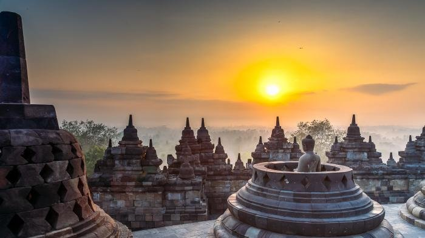
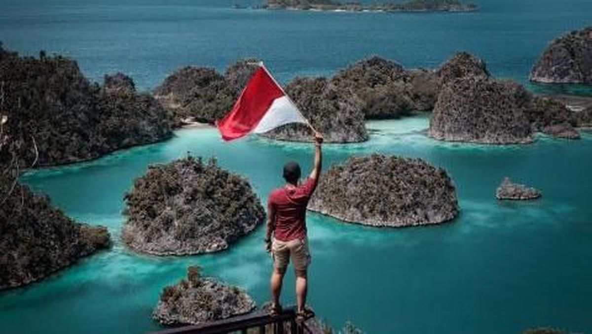
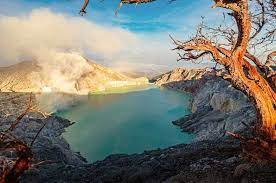
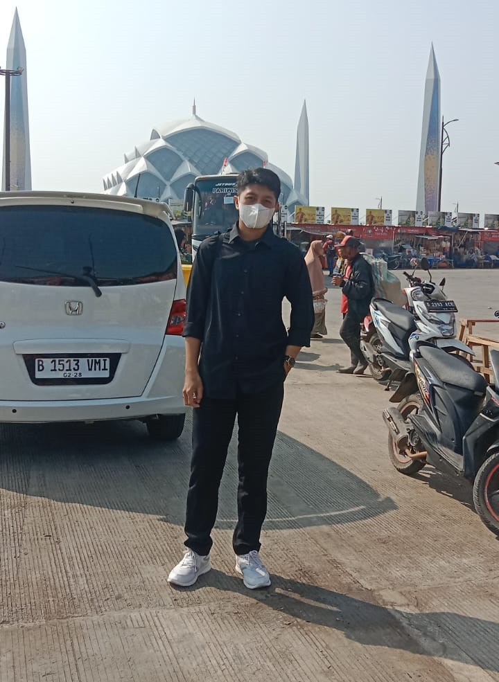
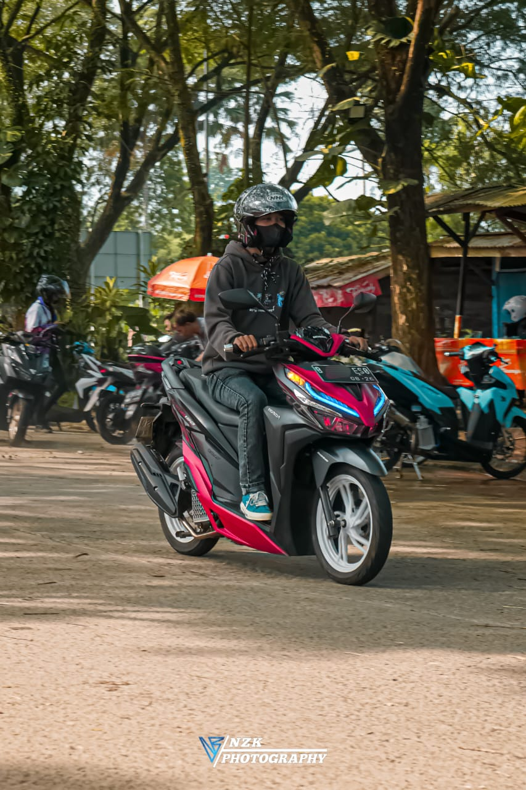
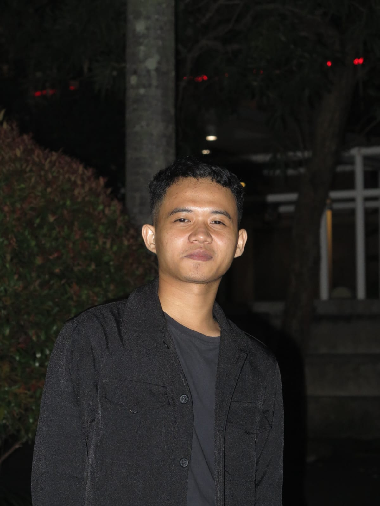

<!DOCTYPE html>
<html lang="en">
  <head>
    <meta charset="UTF-8" />
    <meta http-equiv="X-UA-Compatible" content="IE=edge" />
    <meta name="viewport" content="width=device-width, initial-scale=1.0" />
    <title>Indonesia Tourism</title>
    <link rel="stylesheet" href="style.css" />
    <link rel="shortcut icon" href="asset/Blue_Travel_Logo-removebg-preview.png">
  </head>
  <body>
    <nav>
      

        

          
          
        

        

          <a href="#" class="tombol-menu">
            
            
            
          </a>
          <ul>
            <li><a href="#home">Home</a></li>
            <li><a href="#aboutus">Introduce</a></li>
            <li><a href="#support">Support</a></li>
            <li><a href="#gallery">Gallery</a></li>
            <li><a href="#team">Team</a></li>
            <li><a href="#blog">Informasi</a></li>
            <li><a href="#contact">Contact</a></li>
          </ul>
        

      

    </nav>
    

      <header id="home">
        

        <video autoplay muted loop>
          <source src="asset/Travel To Indonesia _ Drone Aerial View _ No Copyright Videos (1) (1).mp4" type="video/mp4" />
        </video>
        

          <h3>Visit Indonesia</h3>
          

           Keindahan Alam Yang Ada Di Seluruh Indonesia
          

          

              <a href="TempatBudaya.html" class="tombol">MORE INFO</a>
          

        

      </header>
      <main>
        <section id="aboutus">
          

            <h3>Alam Indonesia</h3>
            

              Pemandangan alam adalah keindahan alam yang dapat dipersepsikan melalui komponen mata dalam pancaindra manusia.
              Sketsa pemandangan alam dalam seni lukis biasanya terdiri dari komponen-komponen seperti pepohonan, semak-semak, daratan, bukit, lembah, air ataupun sejumlah benda buatan manusia contohnya rumah, jembatan, mobil dll. 
              Pemandangan alam merupakan suatu hal yang perlu dilindungi atau dijaga karena bertujuan untuk melindungi keindahan alam.
              Indonesia merupakan salah satu negara yang cukup banyak memiliki pemandangan alam yang menarik dan indah misalnya negari Sianok (ngarai Sianok) di Sumatera Barat yang menjadi salah satu potensi wisata dengan fenomena alamnya yang Indah.
            

            

              

                Indonesia banyak memiliki potensi keindahan alam yang memiliki daya tarik yang sangat beraneka ragam sehingga Indonesia merupakan salah satu negara yang paling diminati untuk tujuan pariwisata.
                Selain pemandangan alam yang sangat potensial Indonesia juga merupakan negara yang kaya akan budaya sehingga dengan adanya variasi dan daya tarik tersendiri yang ditawarkan oleh Indonesia membuat Indonesia menjadi wilayah yang cukup menarik untuk dikunjungi.
                Dalam kegiatan seni lukis pemandangan alam merupakan salah satu objek yang paling banyak diminati.
              

            

          

        </section>
        <section class="abuabu" id="support">
          

            

              
              <h6>In Every Condition</h6>
              

                Waktu Indonesia Barat

                Waktu Indonesia Timur

                Waktu Indonesia Tenggara

              

            

            

              
              <h6>Professional Team</h6>
              

                
ASITA ( Asosiasi Travel Agen )

                
 HPI ( Himpunan Pramuwisata Indonesia )

                  
PHRI ( Persatuan Hotel dan Restoran Indonesia ) 

                    
PUTRI ( Perhimpunan Usaha Taman Rekreasi Indonesia ) 

                      
ICA ( Indonesian Chef Association )

              

            

            

              
              <h6>Expert Hikers</h6>
              

                KPGI

                MAPALA

                Team Bapacker

              

            

          

        </section>
        <section id="gallery">
          

          

          

          

          

          

          

          

        </section>
        <section class="quote">
          

            
Jogja terbuat dari rindu, pulang dan angkringan.

          

        </section>
        <section id="team">
          

            <h3>Our Team</h3>
            

              Team ini Terdiri Dari 3 Orang
            

            

              

                
                <h6>Wisnu Galih Prastiyo</h6>
                Web Developer
              

              

                
                <h6>Hasbi Saputra</h6>
                Web Designer
              

              

                
                <h6>Ahmad Kurtubi</h6>
                Web Designer
              

            

          

        </section>
        <section class="abuabu" id="blog">
          

            <h3>Information</h3>
            

            Ringkasan Tempat Wisata
            

            

              

                

                

                  <article>
                    <h4><a href="#">What About Bromo?</a></h4>
                    

                      Wisata Gunung Bromo adalah salah satu tempat wisata di indonesia yang menjadi favorit bagi wisatawan baik dalam negeri maupun luar negeri.
                       Gunung Bromo terletak di Kabupaten Probolinggo. Gunung Bromo memiliki ketinggian sekitar 2392 mdpl.
                    

                  </article>
                

              

              

                

                

                  <article>
                    <h4><a href="#">What About Yogyakarta?</a></h4>
                    

                      Yogyakarta merupakan Ibukota Daerah Istimewa Yogyakarta di Jawa yang terkenal dengan Istana Sultan Yogyakarta atau Keraton Yogyakarta dimana keluarga Sultan masih tinggal di istana tersebut sampai sekarang . 
                    

                  </article>
                

              

            

          

        </section>
      </main>
      <footer id="contact">
        

          

            <h5>Info</h5>
            Untuk Info Lebih Lanjut Tentang Website ini Bisa Chat ke Contact Yang Tersedia
          

          

            <h5>Contact</h5>
              
 <image src="asset/pngtree-instagram-icon-png-image_6315974.png" width="15"> <a href="https://instagram.com/wisnu_galih.p?igshid=OGQ5ZDc2ODk2ZA=="> @wisnu_galih.p </a> 

              
 <image src="asset/sm_5b321c99945a2.jpg" width="15"> 085889247196 

              
 <image src="asset/images.jpeg" width="15"> <a href="wisnugalihp14">wisnugalihp14@gmail.com </a> 
             
          

          

            <h5>Usefull Link</h5>
            
 Faq 

            
 Download Catalog 

            
 Privacy Policy 

            
 Cookie Policy 

          

          

            <h5>Sitemap</h5>
            
Home

            
Introduce

            
Support

            
Gallery

            
Team
 
            
Informasi

            
Contact

          

        

        

          
&copy; 2023 Indonesia Tourism

        

      </footer>
    

    
    
  </body>
</html>

* {
    font-family: Arial, Helvetica, sans-serif;
    line-height: 20px;
    font-size: 15px;
  }
  html {
    margin: 0;
    padding: 0;
    scroll-behavior: smooth;
  }
  body {
    margin: 0px;
    padding: 0px;
  }
  .layar-dalam {
    width: 1000px;
    margin: auto;
  }
  .layar-penuh {
    width: 100%;
    height: 100%;

    margin: auto;
  }
  nav {
    z-index: 100;
    color: #fff;
    text-align: center;
    position: fixed;
    border-bottom: 1px solid #b1b1b1;
    line-height: 60px;
    width: 100%;
    transition: background-color 0.5s ease;
  }
  nav.putih {
    background-color: #fff;
  }
  nav .logo {
    float: left;
    position: relative;
    line-height: 55px;
    text-align: center;
  }
  nav .logo img {
    vertical-align: middle;
    width: 120px;
  }
  
  nav .menu {
    float: right;
    height: 60px;
    max-width: 600px;
  }
  
  nav .menu ul {
    list-style-type: none;
    margin: 0;
    padding: 0;
    display: flex;
  }
  
  nav .menu ul li {
    list-style-type: none;
    float: left;
    line-height: 60px;
  }
  
  nav ul li a {
    color: #fff;
    text-align: center;
    padding: 0px 16px 0px 16px;
    text-decoration: none;
  }
  
  nav ul li a:hover {
    text-decoration: underline;
  }
  
  /* pengaturan header */
  header {
    position: relative;
    height: 100vh;
    width: 100%;
    overflow: hidden;
    z-index: 2;
  }
  header video {
    position: absolute;
    height: 100%;
    width: 100%;
    object-fit: cover;
    
  }
  header .intro {
    z-index: 100;
    color: #fff;
    text-align: center;
    position: relative;
    top: 50%;
  }
  header .intro h3 {
    font-size: 50px;
    margin: 0;
    padding: 0;
  }
  .tombol {
    background-color: #c86b85;
    height: 40px;
    line-height: 42px;
    color: #fff;
    text-decoration: none;
    display: inline-block;
    padding: 0px 20px 0px 20px;
    font-size: 15px;
    border-radius: 4px;
  }
  header .overlay {
    position: absolute;
    top: 0;
    left: 0;
    height: 100%;
    width: 100%;
    background-color: #000;
    opacity: 50%;
    z-index: -1;
  }
  .tombol-menu {
    position: absolute;
    top: 1.7rem;
    right: 1rem;
    flex-direction: column;
    justify-content: space-between;
    width: 30px;
    height: 20px;
  }
  .tombol-menu .garis {
    height: 3px;
    background-color: #fff;
  }
  section {
    padding: 50px 0px 50px 0px;
  }
  section h3 {
    font-size: 30px;
  }
  section h3::after {
    content: "";
    border-bottom: 5px solid #c86b85;
    width: 52px;
    display: block;
    margin: 20px auto;
  }
  #aboutus,
  #team,
  #blog {
    text-align: center;
  }
  section p.ringkasan {
    font-style: italic;
    font-size: 18px;
  }
  section .konten-isi p {
    font-style: italic;
    font-size: 18px;
  }
  nav.putih {
    background-color: #fff;
  }
  nav.putih .tombol-menu .garis {
    background-color: #333;
  }
  nav.putih ul li a {
    color: #333;
  }
  nav .logo img.hitam {
    display: none;
  }
  section.abuabu {
    background-color: #f5f6f6;
  }
  .support,
  .tim,
  .blog {
    display: flex;
    flex-direction: row;
    justify-content: space-around;
  }
  .support h6,
  .tim h6 {
    margin: 0px;
    margin-top: 20px;
    padding: 0px;
    font-size: 18px;
    font-weight: bold;
  }
  .support img {
    width: 50px;
  }
  .support div,
  .tim div {
    text-align: center;
    width: 26%;
  }
  section#gallery {
    display: flex;
    flex-direction: row;
    justify-content: space-around;
    overflow: hidden;
    padding: 10px 0px 10px 0px;
  }
  section#gallery div {
    padding: 10px;
  }
  section#gallery div img {
    height: 100px;
    border-radius: 5px;
  }
  section#gallery div img:hover {
    transition: all 0.2s ease-in-out;
    transform: scale(1.1);
  }
  section.quote {
    background: url("asset/jogja2.jpg") no-repeat;
    background-attachment: fixed;
    background-position: center;
    background-size: cover;
    text-align: center;
    color: #fff;
    font-size: 20px;
    font-style: italic;
    padding: 100px;
  }
  section.quote .layar-dalam p {
    display: inline;
    background: url("asset/quote-icon.png") no-repeat;
    padding: 40px;
  }
  .tim img {
    width: 100%;
    box-shadow: 0px -10px 30px #ccc;
    border-radius: 5px;
  }
  .blog .area {
    width: 80%;
    box-shadow: 0px -10px 30px #ccc;
    border-radius: 5px;
    display: flex;
    flex-direction: row;
    justify-content: space-between;
  }
  .blog div.area div {
    width: 50%;
  }
  .blog .area .gambar {
    border-radius: 5px 0px 0px 5px;
    background-repeat: no-repeat;
    background-size: cover;
    background-position: center;
    height: 300px;
  }
  .blog .area .text article {
    padding: 40px;
  }
  .blog .area .text article h4 {
    margin: 0px;
  }
  .blog .area .text article a {
    color: #333;
    text-decoration: none;
    transition: color 0.5s ease;
  }
  .blog .area .text article a:hover {
    color: #ccc;
  }
  footer {
    padding: 50px 0px 50px 0px;
    background-color: #343a40;
    color: #fff;
  }
  footer .layar-dalam {
    display: flex;
    flex-direction: row;
    justify-content: space-between;
  }
  footer .layar-dalam div {
    width: 20%;
  }
  footer .layar-dalam h5 {
    margin-top: 0px;
    font-size: 20px;
    font-weight: bold;
  }
  footer .layar-dalam .copyright {
    width: 100%;
    margin-top: 30px;
    padding-top: 30px;
    border-top: 1px solid #666;
    text-align: center;
  }
  @media screen and (max-width: 991.98px) {
    .layar-dalam {
      width: 90%;
    }
    nav .menu ul {
      display: none;
      margin-top: 60px;
      position: absolute;
      top: 0;
      left: 0;
      width: 100%;
    }
    nav .menu ul li {
      width: 100%;
      border-bottom: 1px solid #ccc;
      background-color: #fff;
      line-height: 40px;
    }
    nav .menu ul li a {
      color: #333;
    }
    .tombol-menu {
      display: flex;
    }
    .blog .area {
      display: block;
    }
    .blog div.area div {
      width: 100%;
    }
    .blog .area .gambar {
      border-radius: 5px 5px 0px 0px;
      height: 200px;
    }
    .support {
      display: block;
    }
    .support div {
      width: 100%;
      padding-bottom: 30px;
    }
  }

//menu
var tombolMenu = $(".tombol-menu");
var menu = $("nav .menu ul");

function klikMenu() {
    tombolMenu.click(function () {
        menu.toggle();
    });
    menu.click(function () {
        menu.toggle();
    });
}

$(document).ready(function () {
    var width = $(window).width();
    if (width < 990) {
        klikMenu();
    }
})

//check lebar
$(window).resize(function () {
    var width = $(window).width();
    if (width > 989) {
        menu.css("display", "block");
        //display:block
    } else {
        menu.css("display", "none");
    }
    klikMenu();
});

//efek scroll 
$(document).ready(function () {
    var scroll_pos = 0;
    $(document).scroll(function () {
        scroll_pos = $(this).scrollTop();
        if (scroll_pos > 0) {
            $("nav").addClass("putih");
            $("nav img.hitam").show();
            $("nav img.putih").hide();
        } else {
            $("nav").removeClass("putih");
            $("nav img.hitam").hide();
            $("nav img.putih").show();
        }
    })
});
